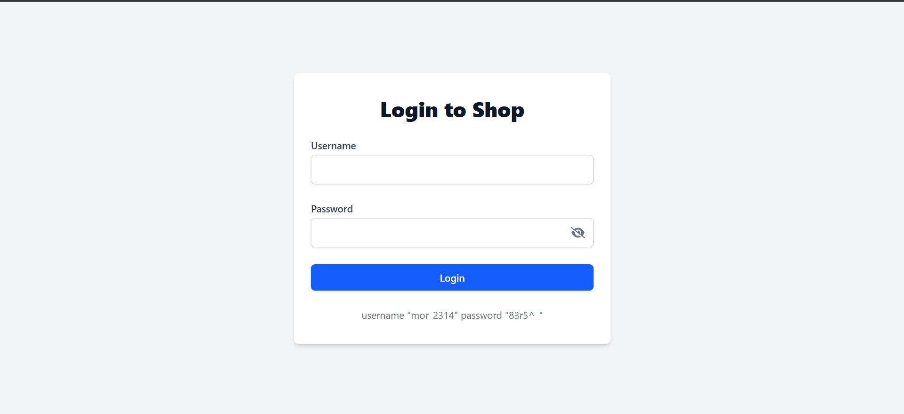
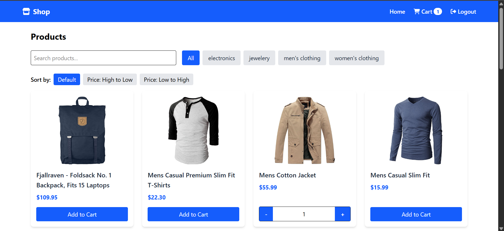
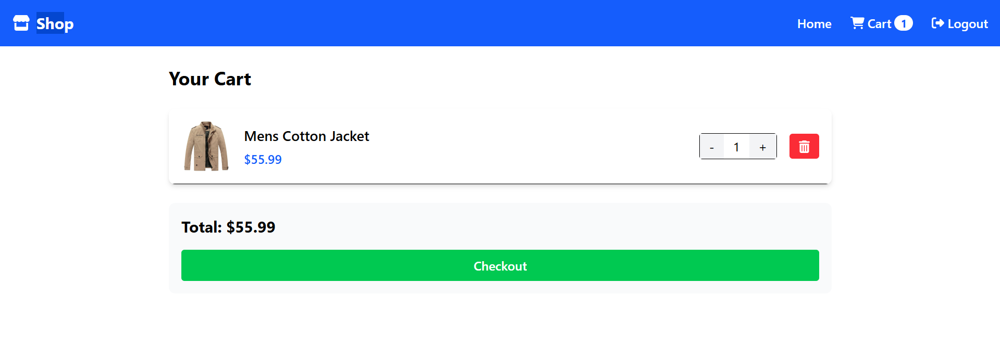

# Shop - React E-commerce Website

## 🚀 Live Demo

[](https://shop-ebon-psi-29.vercel.app/)

## Overview

Shop is a modern, responsive e-commerce website built with React. The application provides a seamless shopping experience with features like user authentication, product browsing, cart management, and checkout functionality.

## 🚀 Features

- **User Authentication** - Secure login system with token-based authentication
- **Product Catalog** - Browse products with category filtering and search functionality
- **Product Details** - View detailed information about each product
- **Shopping Cart** - Add, remove, and update quantities of products
- **Responsive Design** - Optimized for both desktop and mobile devices
- **Category Filtering** - Filter products by categories
- **Search Functionality** - Search products by name
- **Interactive UI** - User-friendly interface with intuitive navigation

## 🛠️ Technologies Used

- **React** - Frontend library for building the user interface
- **React Router** - For navigation and routing
- **Tailwind CSS** - For styling and responsive design
- **Fake Store API** - For product data and authentication
- **FontAwesome** - For icons and visual elements
- **LocalStorage** - For persisting cart and authentication state

## 📋 Prerequisites

- Node.js (v14.0.0 or later)
- npm (v6.0.0 or later)

## 🔧 Installation

1. Clone the repository
   ```bash
   git clone https://github.com/Saksham-Goel1107/Shop.git
   cd shop
   ```

2. Install dependencies
   ```bash
   npm install
   ```

3. Start the development server
   ```bash
   npm run dev
   ```

4. Open your browser and navigate to `http://localhost:5173`

## 🔑 Usage

### Login
Use the following credentials to log in:
- Username: `mor_2314`
- Password: `83r5^_`

### Product Browsing
- Browse all products on the home page
- Filter products by categories
- Search for products using the search bar
- Click on a product to view details

### Shopping Cart
- Add products to your cart
- Update quantities directly from product pages or cart
- Remove items from cart
- Proceed to checkout

## 📁 Project Structure

```
shop/
├── public/
│   └── icon.png
├── src/
│   ├── components/
│   │   └── header.jsx
│   ├── pages/
│   │   ├── cart.jsx
│   │   ├── login.jsx
│   │   ├── productDetails.jsx
│   │   └── productListing.jsx
│   ├── App.jsx
│   ├── index.css
│   └── main.jsx
├── index.html
├── package.json
└── README.md
```

## 🌐 API Reference

This project uses the [Fake Store API](https://fakestoreapi.com/docs) for product data and authentication.

### Endpoints Used:
- `GET /products` - Get all products
- `GET /products/categories` - Get all categories
- `GET /products/category/{categoryName}` - Get products by category
- `GET /products/{id}` - Get a single product
- `POST /auth/login` - User authentication

## 📸 Screenshots





## 🚀 Future Enhancements

- User registration functionality
- Product reviews and ratings
- Order history tracking
- Wishlist feature
- Payment gateway integration
- Admin dashboard for product management

## 👥 Contributors

- Saksham Goel - [GitHub](https://github.com/Saksham-Goel1107/)

## 📝 License

This project is licensed under the MIT License - see the LICENSE file for details.

## 🙏 Acknowledgments

- [Fake Store API](https://fakestoreapi.com/) for providing the product data
- [Tailwind CSS](https://tailwindcss.com/) for the styling framework
- [FontAwesome](https://fontawesome.com/) for the icons
- [React](https://reactjs.org/) and [React Router](https://reactrouter.com/) for the frontend framework

---

*Made with ❤️ by [Saksham Goel](https://github.com/Saksham-Goel1107)*